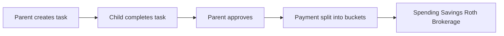

# MintSprout Parent Guide

A detailed manual for parents using MintSprout at home. This guide explains how the app works, what each screen does, and step-by-step workflows for everyday use.

For installing MintSprout on a server, see the [README](../README.md). For technical maintenance, see [WIKI.md](../WIKI.md) and [DEPLOYMENT.md](../DEPLOYMENT.md).

---

## Table of contents

1. [Introduction](#introduction)
2. [Getting started](#getting-started)
3. [How MintSprout works](#how-mintsprout-works)
4. [Navigation for parents](#navigation-for-parents)
5. [Page-by-page guide](#page-by-page-guide)
6. [Step-by-step workflows](#step-by-step-workflows)
7. [Sprout AI coach](#sprout-ai-coach)
8. [Tips, safety, and troubleshooting](#tips-safety-and-troubleshooting)

---

## Introduction

MintSprout is a family financial literacy app. Kids learn to **earn, save, spend, invest, and donate** through chores, allowance, lessons, and real money tracking — while parents approve tasks, set rules, and stay in control.

### Parent vs child roles

| Role | What they can do |
|------|------------------|
| **Parent** | Create tasks, approve work, pay allowance, set rules, manage lessons, view all children, configure the app |
| **Child** | See their tasks, mark work complete, log spending and donations, set savings goals, take lessons and quizzes |

Parents have two extra pages in the menu: **Controls** and **Family**. Children never see those pages.

### How age changes the kid experience

Each child's **age** (set on the Family page) controls how simple their screens look:

| Age | Mode | What kids see |
|-----|------|---------------|
| 6 and under | **Youngest** | Simplified labels and icons; fewer menu items (Home, Tasks, Learn, My Money only) |
| 7–10 | **Younger** | Standard kid UI with Goals added; quiz questions can be read aloud |
| 11+ | **Older** | Full kid UI including Spending, Donations, History, and Reports |

Parents always see the full interface regardless of which child they are viewing.

---

## Getting started

### Logging in

MintSprout supports two login styles:

**Username and password**

- Open the app and sign in with your parent account (default after first install: username `parent`, password `password123`).
- Children can sign in with their own username and password on the same screen.

**Profile picker (kiosk mode)**

- Intended for a shared family tablet or home computer.
- The login screen shows **Parent** and each child's name.
- **Child**: tap their name to enter their session — no password.
- **Parent**: tap **Parent**, enter the **parent PIN**, then enter the parent session.

Kiosk mode is enabled by default in Docker. You can change the PIN in **Controls → Sprout & App → Login and profiles**, or via environment variables (`KIOSK_MODE`, `PARENT_PIN`).

### First-time checklist

After your first login as parent, work through this list:

1. **Change the parent password** — Do not leave `password123` in place (`npm run passwords:reset` in the app container).
2. **Add children** — **Family → Add Child** with name, age, username, and password. Edit profiles or change passwords from **Family → Edit** on any child card.
3. **Choose money buckets** — **Home** → open account type settings and enable which buckets your family uses (Spending, Savings, Future Fund, Grow Fund).
4. **Set allocation percentages** — **Controls → Allocation** → pick each child and set how each payment is split across buckets (must total 100% across enabled account types).
5. **Set up allowances** (if you use them) — **Controls → Allowances** → create a weekly or monthly allowance per child.
6. **Review approval rules** — **Controls → Approvals** → turn on/off parent approval for spending, donations, and goal funding.
7. **Optional: Sprout AI** — **Controls → Sprout & App** → configure LLM and voice, or disable Sprout if you do not use AI features.
8. **Optional: back up** — **Controls → Sprout & App → Database backup & restore** → download a backup before major changes or host moves.

---

## How MintSprout works

### The big picture

1. You assign a task to a child.
2. The child marks it in progress, then complete.
3. You review and **approve** it.
4. For paid tasks, money is deposited and **split** into the child's buckets based on their allocation settings.

### Four money buckets

When a child earns money, it is divided into up to four accounts:

| Bucket | Also called | Typical use |
|--------|-------------|-------------|
| **Spending** | Spend | Day-to-day purchases |
| **Savings** | Save | Short-term savings and goals |
| **Future Fund** | Roth IRA | Long-term investing concept |
| **Grow Fund** | Brokerage | Stock market / growth concept |

You choose which buckets are active for your family (**Home** → account type settings). Disabled buckets are skipped when paying.

### Per-child allocation

Each child has their own split percentages (default is often 20% Spending, 30% Savings, 25% Future Fund, 25% Grow Fund). Edit in **Controls → Allocation** (`/controls?tab=allocation`). **Home** shows a summary for the selected child and links there via **Set Allocations**.

When you approve a paid task, you can accept the default split or customize it for that single payment.

### Task lifecycle

| Status | Meaning |
|--------|---------|
| **Assigned** | Task created; child has not started |
| **In progress** | Child is working on it |
| **Completed** | Child says they are done — **waiting for your approval** |
| **Approved** | You approved it; payment applied if the task pays money |

Tasks that do not pay (self-care, family duty) still go through approve/deny, but no money moves.

### Pay types

Tasks belong to **categories**. Each category has a payment mode:

| Pay type | When money moves | Example |
|----------|------------------|---------|
| **No pay** | Never | Make bed, brush teeth |
| **Allowance** | Counts toward weekly/monthly allowance, not instant cash | Take out trash, vacuum |
| **One-time pay** | Paid when you approve | Babysitting, yard project |
| **Flexible pay** | You choose paid or unpaid when creating the task | Reading, exercise (Mind & Body category) |
| **Family duty** | Never | Helping without pay |

Allowance tasks affect the **allowance payout** at the end of the period — incomplete or unapproved chores can reduce the variable portion of allowance.

### Allowance model

Configured in **Controls → Allowances** for each child:

- **Total allowance** — Full amount if all allowance chores are done and approved.
- **Guaranteed minimum** — The child always receives at least this much, even with missed chores.
- **Penalty per incomplete job** — Each allowance chore still **not approved** before payout reduces the *non-guaranteed* part of allowance. You do not need to click **Mark missed** for penalties to apply; that button is optional for tracking chores in the Payments panel.
- **Period** — Weekly (with configurable start/end/pay days) or monthly.
- **Payout mode**:
  - **Automatic** — Pays on schedule when the period ends.
  - **Manual** — You pay from **Tasks → Payments** when you are ready.

Use **Tasks → Payments** tab to see each child's current period, missed chores, and pay early if you want.

### Approval requests (spending, donations, goals)

If enabled in **Controls → Approvals**, when a child logs spending, a donation, or adds money toward a savings goal, it creates a **pending request** instead of applying immediately. You approve or deny from **Controls → Approvals**.

---

## Navigation for parents

### Menu and avatar

- **Menu** (top bar) — Lists every page. The current page is highlighted.
- **Avatar** (top right) — Your name, **View as child** (pick which child's data to see on Home, Learn, Goals, etc.), and **Logout**.

**View as child** does not log you in as the child. It filters dashboards and per-child pages to that child's data while you remain the parent.

### All pages (parent view)

| Page | Route | What parents use it for |
|------|-------|-------------------------|
| **Home** | `/dashboard` | Overview, quick actions, approve tasks, allocation and account settings |
| **Tasks** | `/jobs` | Create and edit tasks, approve work, allowance payouts |
| **Learn** | `/learn` | See lesson progress for the selected child |
| **Payment History** | `/payments` | All payments and bucket balances |
| **Goals** | `/savings` | Savings goals for the selected child |
| **Spending** | `/spending` | Spending log for the selected child |
| **Donations** | `/donations` | Donation log for the selected child |
| **History** | `/activity` | Full transaction ledger; export CSV |
| **Reports** | `/reports` | Charts, date ranges, compare children |
| **Controls** | `/controls` | Rules, allowances, allocation, catalogs, Sprout and app settings |
| **Family** | `/family` | Add/edit children, family-wide stats |

---

## Page-by-page guide

### Home (`/dashboard`)

Your command center.

- **Select a child** from the avatar menu to see that child's stats, active tasks, and balances on Home.
- **Pending approvals** — Banner or list of tasks waiting for you; approve from here or go to Tasks.
- **Quick actions** — Create a task, go to **Set Allocations** (opens **Controls → Allocation**), account types, or savings goals.
- **Savings goals** — See active goals for all children (or only the selected child when using **View as child**). Open **Family** or **Goals** for more detail.
- **Sprout** — If AI is enabled, Sprout buddy and daily brief appear here for kids; as parent you configure Sprout under Controls.

**Allocation summary** — Home displays Spending / Savings / Future Fund / Grow Fund percentages for the selected child. To edit, use **Set Allocations** (navigates to **Controls → Allocation**). Percentages must add to 100% across **enabled** account types only.

**Account types** — Choose which buckets exist for your family (e.g. hide Roth IRA for younger kids).

### Tasks (`/jobs`)

Where most day-to-day parent work happens.

**Creating a task**

1. Click create / add task.
2. Choose **Pay type** (no pay / allowance / one-time pay) — you can override the category default.
3. Pick a **category** (self-care, allowance chores, one-time pay, etc.), then enter title, description, icon, and **recurrence** (once, daily, weekly, monthly).
4. **Assign to** — pick one child, or **All children** when you have two or more kids (creates one identical task per child).
5. For **one-time pay**, enter the amount. For **allowance** with one child, pick which allowance to tie to; for **All children**, each child is linked automatically to their own allowance.

Use **Browse library** under a category in **Controls → Tasks** to import templates for faster creation.

**Assign to All children**

When you have multiple children, **Assign to** includes **All children**. The button reads **Create for all**.

| Pay type | What happens |
|----------|----------------|
| **No pay / family duty** | Every child gets the same task. |
| **One-time pay** | Every child gets the same task at the same amount. |
| **Allowance** | Each child is linked to their own enabled allowance. Children with **no** allowance or **more than one** enabled allowance are skipped — the success message lists who was skipped and why. |

Keep **one enabled allowance per child** if you use bulk allowance tasks. Fix duplicates in **Controls → Allowances**.

**Approving tasks**

- Filter by status **Completed** to see work waiting on you.
- Click **Approve**. For one-time paid tasks, a **payment modal** shows the split across buckets; confirm or adjust, then approve.
- Unpaid tasks approve with one click.

**Tabs**

- **Active** — Assigned and in-progress work.
- **Completed** — Awaiting approval or recently finished.
- **Payments** — Allowance payout panel: period summary, missed chores, manual pay button.

**Other tools**

- Search and filter by child or status.
- Bulk select tasks for batch approve or delete (parent only).
- Edit or delete tasks you created.

Direct link: **Tasks → Payments** (`/jobs?view=payments`) for allowance payout.

### Learn (`/learn`)

Financial lessons with videos, Sprout voice sessions, and quizzes.

- **Parents**: Use **View as child** first, then open Learn to see **that child's progress** (completed lessons, quiz scores, voice lesson completion).
- **Kids (ages 11+)**: Browse categories, **read** lesson text or watch videos, optionally use **Learn with Sprout** voice, then take the quiz — reading and voice are both available when content exists.
- **Kids (ages 7–10)**: Watch videos when available; lessons **without** a video or readable text require **Learn with Sprout** before the quiz. Quiz questions are read aloud automatically.
- **Kids (ages 5–6)**: Same voice/video rules as 7–10; UI uses icons and Sprout voice is the primary path for text-only lessons.
- Quiz is **locked** until preparation: Sprout voice session (`preparedAt`), **watching the video** (younger kids), or **reading published content** (older kids).

**Publishing lessons (parents)**

Lessons visible to kids come from your **lesson catalog**, managed in **Controls → Lessons** (see workflows below). The built-in library seeds on first visit; you can import, edit, and publish custom lessons.

### Payment History (`/payments`)

- See every payment and current **balance in each bucket** (for all children or per child depending on context).
- Useful to answer "where did their money go?" after approvals.

### Goals (`/savings`)

- Children create savings goals (name, target amount, optional deadline).
- Parents view and manage goals for the **selected child** (use **View as child** in the avatar menu first).
- Use **Add funds (parent)** on Goals to contribute without deducting the child's savings balance.
- To see **every child's goals** at once, use **Home** (summary card) or **Family** (full list with progress).
- If **Require goal funding approval** is on in Controls, child-initiated funding waits for your approval.

### Spending (`/spending`)

- Log of what the child bought, by category (food, toys, clothes, etc.).
- Deducts from **Spending** balance when approved (or immediately if approval is off).
- Parents review the selected child's log; approve pending entries from Controls if rules require it.

### Donations (`/donations`)

- Track charitable giving: organization, cause, amount, date.
- Same approval pattern as spending if **Require donation approval** is enabled.

### History (`/activity`)

- Complete ledger: payments, spending, donations, goal transfers, refunds.
- Filter by date range and child (parents).
- **Export CSV** for records or taxes.

### Reports (`/reports`)

- Charts for earnings, allocation breakdown, tasks over time.
- Set **date range** and filter by child.
- **Child Comparison** tab (parents only) — side-by-side view of multiple children.

Youngest children are redirected away from Reports (too complex for their UI mode).

### Family (`/family`)

- **Add child** — Name, age, username (optional — auto-generated from name if blank), and password (required for new accounts).
- **Edit child** — Update name, age, username, or set a new password (leave password blank to keep the current one).
- **Remove** children (also deletes their login).
- Summary cards: total children, family earnings, active vs completed tasks.
- Per-child cards show login username, earnings, and progress.
- **Savings goals** — Lists every child's goals and progress (read-only overview). Use **Goals** for the selected child's details or to add parent funds.

Removing a child is permanent — confirm carefully.

### Controls (`/controls`)

Parent-only settings hub with six tabs.

#### Approvals

- Toggle **Require spending approval**, **Require donation approval**, **Require goal funding approval**.
- **Pending requests** list with Approve / Deny buttons; refreshes automatically.

#### Allowances

- Create allowance per child: amount, guaranteed minimum, penalty per missed job, weekly or monthly schedule.
- Weekly: set **period start**, **period end**, and **pay day**.
- **Payout mode**: automatic vs manual.
- Edit rules or delete an allowance; enable/disable without deleting.
- For **Assign to All children** allowance tasks, keep **one enabled allowance per child**. If a child has multiple enabled allowances, they are skipped when you bulk-create allowance chores.

#### Allocation

- Set per-child **Spending / Savings / Future Fund / Grow Fund** percentages.
- Select a child, adjust sliders or fields, then save. Enabled buckets must total **100%**.
- Linked from **Home** via **Set Allocations** (`/controls?tab=allocation`).

#### Tasks (categories and catalog)

- Edit task **categories**: name, icon, description, payment mode, order.
- Under each category: **task catalog** — import from library, customize templates used when creating tasks.
- Add new custom categories.

#### Lessons

- Per category (Earning, Saving, etc.): import lesson templates, edit content and video, **Publish** to make lessons live on the Learn page.
- Published lessons include quiz questions for kids.

#### Sprout & App

- **Sprout AI coach** — Enable/disable for kids.
- **LLM** — Open WebUI URL, API key, model; Ollama fallback.
- **Voice** — Kokoro TTS URL and voice IDs by age band.
- **Login** — Kiosk mode, parent PIN, kiosk family ID, JWT secret (rotation logs everyone out).
- **Database backup & restore** — Scheduled daily/weekly backups to disk, download `.sql`, upload to restore (type `RESTORE` to confirm).
- **Test LLM** / **Test Voice** — connectivity checks.

Settings saved here override `.env` / Docker defaults immediately without restarting containers.

---

## Step-by-step workflows

### 1. Weekly allowance routine

1. **Controls → Allowances** — Confirm each child has an allowance with the right amount, period days, and payout mode.
2. During the week, children complete **allowance category** tasks; you **approve** them on Home or Tasks as they finish.
3. Before pay day, open **Tasks → Payments** tab.
4. Review **missed chores** and the calculated payout (guaranteed floor minus penalties).
5. If payout mode is **manual**, click pay when satisfied. If **automatic**, payout runs on the scheduled pay day.
6. Check **Payment History** or **History** to confirm deposit.

### 2. Create and pay a one-time chore

1. **Tasks** → Create task.
2. Choose a **one-time pay** category (or flexible category with pay enabled).
3. Set **amount**, assign **child**, save.
4. Child marks complete when done.
5. **Tasks** → filter Completed → **Approve**.
6. In the payment modal, review bucket split → confirm.
7. Child sees updated balances on **My Money** / Payment History; confetti may play on approval.

### 3. Set per-child allocation percentages

1. Open **Controls → Allocation** (`/controls?tab=allocation`), or tap **Set Allocations** on Home.
2. Select a child from the dropdown.
3. Adjust Spending / Savings / Future Fund / Grow Fund percentages.
4. Ensure enabled buckets total **100%** → Save.
5. Repeat for each child if splits differ.

### 4. Handle a spending approval

1. Ensure **Require spending approval** is on in **Controls → Approvals** (if you want this flow).
2. Child logs a purchase on **Spending**.
3. You receive a pending item under **Controls → Approvals**.
4. Read amount and details → **Approve** (deducts from Spending balance) or **Deny**.
5. Child sees updated status on their Spending page.

Same pattern for donations and goal funding with their respective toggles.

### 5. Publish a lesson to the Learn page

1. **Controls → Lessons**.
2. Pick a category section (e.g. Saving).
3. **Browse library** → import a template (or edit an existing catalog item).
4. Customize title, body content, video URL, quiz questions in the editor.
5. Click **Publish** — lesson appears on **Learn** for children.
6. Optionally **View as child** → **Learn** to verify progress tracking.

### 6. Sprout voice lesson flow (what kids experience)

1. Child opens **Learn** and selects a lesson.
2. **If the lesson has no video and little readable text** (voice-only): **Learn with Sprout** is required before the quiz (all ages).
3. **Ages 7–10**: If a **video** is published, watching it unlocks the quiz; Sprout voice is optional. Text-only lessons still require Sprout voice.
4. **Ages 11+**: If the lesson has **text or video**, the child may read/watch and take the quiz directly, or choose **Learn with Sprout** instead.
5. Child passes quiz → lesson marked complete; achievements may update.

As parent, ensure Sprout is enabled and LLM/voice URLs work (**Controls → Sprout & App → Test LLM / Test Voice**). Without AI configured, voice lessons may not run; lesson text and video may still be available depending on content.

### 7. Back up before moving hosts

1. **Controls → Sprout & App → Database backup & restore**.
2. Click **Download backup** — save the `.sql` file somewhere safe (cloud drive, USB).
3. On the new server, deploy MintSprout (see README).
4. **Restore from backup** — upload the same file, type `RESTORE`, confirm.
5. Refresh the browser and log in. All family data, settings, and progress should match the backup.

Alternatively, use automatic dumps in `MINTSPROUT_BACKUPS_DIR` (default `./data/backups/daily` and `.../weekly`) from the in-app scheduler (**Sprout & App**), or `./scripts/backup-db.sh manual` on the Docker host.

### 8. Assign the same task to all children

1. **Tasks** or **Home** → Create task.
2. Set pay type, category, title, recurrence, and amount (if one-time pay) as usual.
3. **Assign to** → **All children** → **Create for all**.
4. Read the success message — it shows how many tasks were created and lists any skipped children (for example, no allowance set up).

**Examples:** Daily "Make bed" for everyone (no pay); the same yard-work one-time pay amount for each child; allowance chores like "Take out trash" linked to each child's allowance.

---

## Sprout AI coach

Sprout is an optional AI helper for kids: chat buddy, daily brief, and voice-led lessons.

### Parent configuration

All settings: **Controls → Sprout & App** (`/controls?tab=sprout`).

| Setting | Purpose |
|---------|---------|
| Enable Sprout for kids | Master on/off |
| Open WebUI | Primary chat LLM (URL, API key, model) |
| Ollama fallback | Used if Open WebUI is unavailable |
| Voice API | Text-to-speech for Sprout (Kokoro or compatible) |
| Voice IDs | Different voices for youngest / younger / older kids |
| Test LLM / Test Voice | Verify connectivity before kids use it |

You can set initial values in Docker `.env` and change them later in the UI without restarting.

### What kids see

- **Sprout buddy** — Floating helper on supported pages; quick prompts and chat.
- **Daily brief** — Short personalized summary on Home / Tasks when enabled.
- **Learn with Sprout** — Voice lesson before each quiz.

Sprout does not move money or approve tasks — it teaches and encourages.

---

## Tips, safety, and troubleshooting

### Security habits

- Change default passwords immediately after install.
- Use a strong **parent PIN** in kiosk mode on shared devices.
- Rotating **JWT secret** in Sprout & App settings logs **everyone** out — do this only when needed.
- Database **restore overwrites all data** — always download a fresh backup first.

### When balances look wrong

1. **History** — Find the exact transaction (payment, spend, donation, goal transfer).
2. **Reports** — Check date range and correct child filter.
3. **Tasks** — Confirm tasks are **Approved**, not just Completed (completed but unpaid tasks do not deposit money).
4. **Allowance** — Check **Tasks → Payments** for penalties and whether payout already ran this period.
5. **Approval queue** — Pending spending/donations may not have hit balances yet.

### Kid cannot see a page

Youngest and younger modes hide some menu items on purpose. Older children see the full kid menu. This is based on **age** on the Family page — update age if a child has outgrown simplified UI.

### Sprout or voice not working

- **Controls → Sprout & App** → run **Test LLM** and **Test Voice**.
- Confirm URLs reach your LAN or cloud services from the server running MintSprout (not just from your laptop).
- Disable Sprout if you prefer lessons without AI; videos and quizzes may still work from published lesson content.

### Kiosk / login issues

- Wrong parent PIN → update in **Controls → Sprout & App** or `PARENT_PIN` in environment.
- Child missing from picker → check they exist on **Family** and match **kiosk family ID** if you changed it.

### Getting help

- Installation and Docker: [README](../README.md)
- Backups and production: [DEPLOYMENT.md](../DEPLOYMENT.md)
- Technical details: [WIKI.md](../WIKI.md)

---

*MintSprout — teach money skills early, together as a family.*
